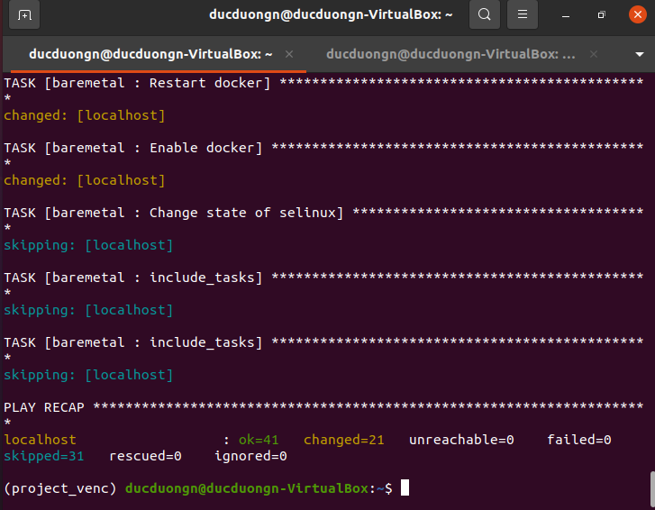
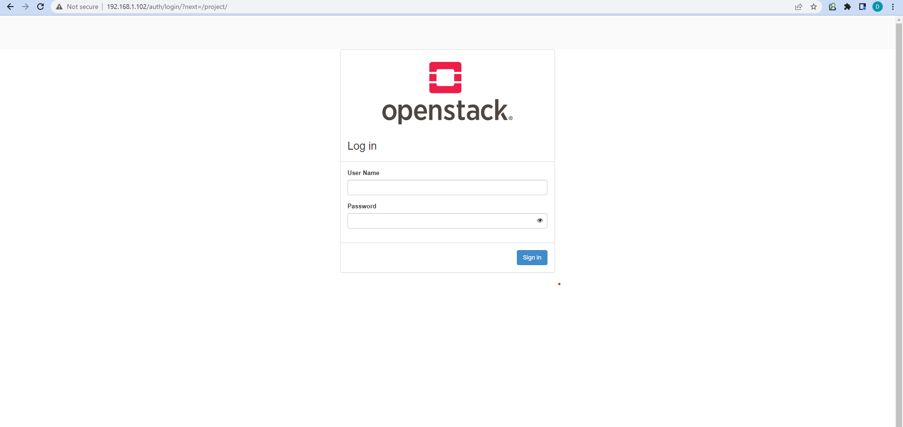
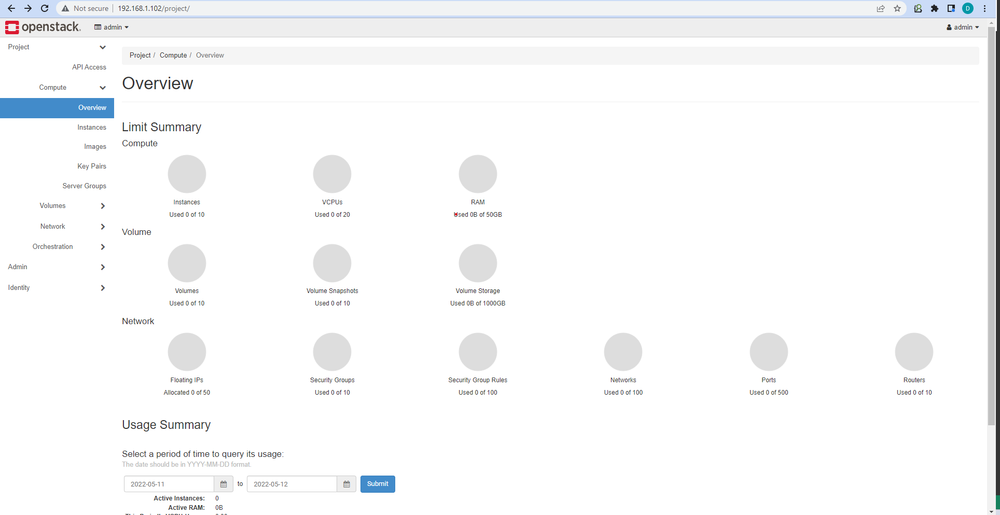

# **Cài đặt Openstack All-in-one bằng Kolla Ansible**
## **Table of Contents**

- [I. Tổng quan ](#overview)   
   - [1. Openstack](#openstack)           
   - [2. Kolla-Ansible](#kolla-ansible)                  
- [II. Yêu cầu](#yêu_cầu)   
   - [1. Kiến thức](#kiến_thức)      
   - [2. Cấu hình](#cấu_hình)       
         
- [III. Các bước thực hiện](#các_bước_thực_hiện)        
   - [1. Thiết lập môi trường ](#thiết_lập_môi_trường)    
   - [2. Cấu hình Openstack All In One](#cấu_hình_openstack_all_in_one)       
   - [3. Cài đặt Openstack All In One](#cài_đặt_openstack_all_in_one)                 
   - [4. Đăng nhập vào Horizon ](#đăng_nhập_vào_Horizon)          
- [Tài liệu tham khảo](#Tài_liệu_tham_khảo)             
----  

## I. Tổng quan

### 1. Openstack

#### a) Tổng quan về Openstack

#### b) Các thành phần trong Openstack

### 2. Kolla Ansible


## II. Cài đặt Ubuntu trên VirtualMachine


## III. Yêu cầu

### 1. Kiến thức cơ sở

- Kiến thức cơ bản về Ansible.

- Kiến thức cơ bản về Docker.

- Kiến thức cơ bản về Linux và Mạng máy tính.

### 2. Đề xuất cấu hình

||Đề xuất|Cấu hình trong demo|     
|----|----|----|    
|CPU| 4 cores| 4 cores|   
|RAM| 8GB| 8GB|    
|HDD| 2 Disks| 2 Disks|   
|Network| 2 NICs| 2 NICs|   

## IV. Các bước thực hiện cài đặt Openstack All-in-one bằng Kolla Ansible

### 1. Cài đặt các dependencies

- Đầu tiên cập nhật chỉ mục các package
```
$ sudo apt update 
```

- Sau đó cài đặt các package cần thiết

```
$ sudo apt install python3-dev libffi-dev gcc libssl-dev
```

- Tiếp theo ta tiến hành cài đặt môi trường ảo. Việc sử dụng môi trường ảo sẽ giúp tách biệt các môi trường của nhiều project khác nhau nhằm ngăn sự xung đột giữa các project. Công cụ sử dụng để tạo môi trường ảo là python3-venv.

```
$ sudo apt install python3-venv
```

- Sau khi cài đặt thư viện, tiến hành tạo môi trường ảo:

```
$ python3 -m venv /path/to/venv
```

Trong đó `/path/to/venv` là đường dẫn tới thư mục định nghĩa ra môi trường ảo, trong đó có chứa các file thực thi của Python và module pip (module để cài đặt các package và module khác). Đường này tùy chỉnh theo ý muốn.

- Sau khi tạo môi trường ảo, tiến hành kích hoạt môi trường ảo. 

```
$ source /path/to/venv/bin/activate      
```

- Cần đảm bảo phiên bản mới nhất của pip được tải: 

```
$ pip install -U pip
```

- Sau đó ta tiến hành tải Ansible. Do phiên bản Openstack dự định được tải là `Xena`, do đó phiên bản Ansible yêu cầu từ 2.10 tới phiên bản 4.

```
# pip install 'ansible<5.0'
```

### 2. Cài đặt Kolla-ansible

- Tiến hành tải về kolla-ansible

```
$ pip install git+https://opendev.org/openstack/kolla-ansible@stable/xena
```

- Tiếp theo tạo một thư mục mới `/etc/kolla`

```
$ sudo mkdir -p /etc/kolla
$ sudo chown $USER:$USER /etc/kolla
```

- Copy file `global.yml` và `password.yml` từ trong gói `kolla-ansible` trong môi trường ảo tới thư mục vừa tạo `/etc/kolla`:

```
$ cp -r /path/to/venv/share/kolla-ansible/etc_examples/kolla/* /etc/kolla
```

- Copy file `all-in-node` và `multinode` trong thư mục `inventory` tới thư mục hiện tại:

```
$ cp /path/to/venv/share/kolla-ansible/ansible/inventory/* .
```

### 3. Cấu hình ansible

- Tạo thư mục mới chưa file cấu hình Ansible `/etc/ansible`:

```
$ sudo mkdir /etc/ansible
```

- Tiến hành mở file `ansible.cfg` bằng trình edit:

```
$ sudo gedit /etc/ansible/ansible.cfg
```

- Sau đó nhập nội dung cấu hình như sau:

```
[defaults]
host_key_checking=False
pipelining=True
forks=100
```

### 4. Cấu hình Openstack All-in-one

- Đầu tiên kiểm tra xem liệu cấu hình inventory đã chính xác hay chưa:

```
$ ansible -i all-in-one all -m ping
```

Kết quả: 
   

- Tiếp theo là generate mật khẩu sử dụng cho quá trình triển khai. Các mật khẩu này được lưu ở file `/etc/kolla/passwords.yml`. Ban đầu các mật khẩu này đều trống. Để tự động sinh ra mật khẩu ngẫu nhiên và tự động điền cho các trường trong file này, chạy lệnh:

```
$ kolla-genpwd
```

- Tạo phân cùng cho `Cinder`:

```
$ sudo pvcreate /dev/sdb  
$ sudo vgcreate cinder-volumes /dev/sdb  
```


- Tiếp theo là cấu hình file `/etc/globals.yml` :

```
kolla_base_distro: "ubuntu"
kolla_install_type: "source"

network_interface: enp0s3
neutron_external_interface: enp0s8
kolla_internal_vip_address: 192.168.1.102

nova_compute_virt_type: "qemu"

enable_haproxy: "no"

enable_cinder: "yes"
enable_cinder_backup: "no"
enable_cinder_backend_lvm: "yes"
```

### 5. Triển Khai

- Khởi tạo môi trường dành cho Openstack Kolla:

```
$ kolla-ansible -i all-in-one bootstrap-servers   
```

Kết quả:
   

- Tiếp theo kiểm tra thiết lập Kolla Ansible:

```
$ kolla-ansible -i all-in-one prechecks   
```

Kết quả:
   

- Triển khai OpenStack:

```
$ kolla-ansible -i all-in-one deploy 
```

Kết quả:
   

- Thiết lập file Environment Openstack:

```
$ kolla-ansible -i all-in-one post-deploy   
```
Kết quả:
    

### 5. Sử dụng Openstack

- Lấy mật khẩu để đăng nhập tài khoản admin:  
```    
$ cat /etc/kolla/passwords.yml | grep keystone_admin    
```

Kết quả: 
   

- Truy cập vào địa chỉ `http://192.168.1.102/auth/login/?next=/project/` để đăng nhập. Trong đó: 

    - `username` : admin
    - `password` : OZ7RfrjKyb7dRjUQJBr9wWApR8NL6gqQBG4eSCuH

   

- Sau khi đăng nhập thành công:

   


## Tài liệu tham khảo

[1] https://docs.openstack.org/kolla-ansible/xena/user/quickstart.html
 
[2] https://github.com/inc0/kolla-ansible-workshop/blob/master/chapter1.md

[3] https://docs.python.org/3/library/venv.html

[4] https://github.com/vietstacker/Viettel-Digital-Talent-Program-2021/blob/main/Phase-1-Practices/Week-3/Julian-P-Nguyen/Openstack/README.md