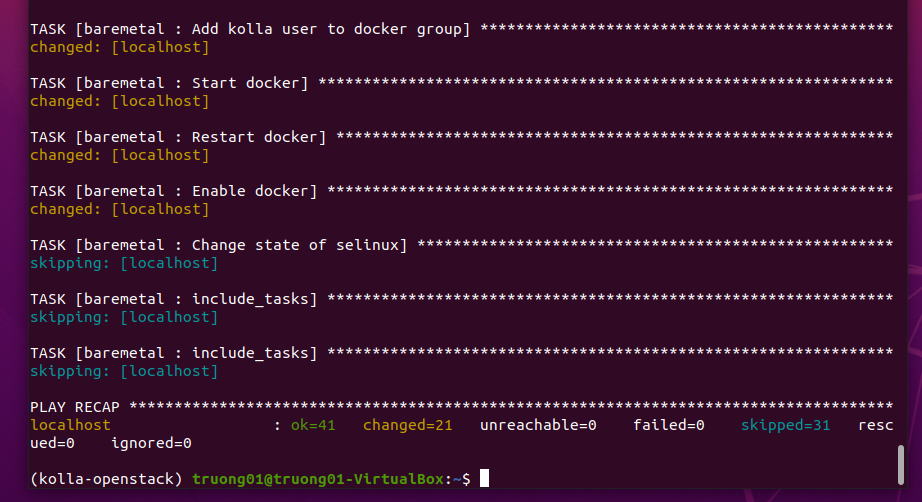
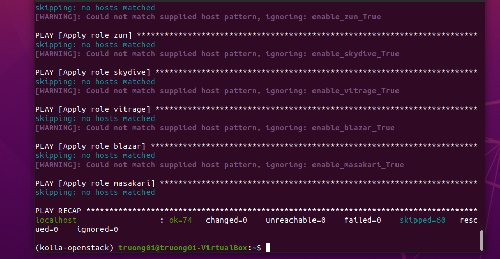
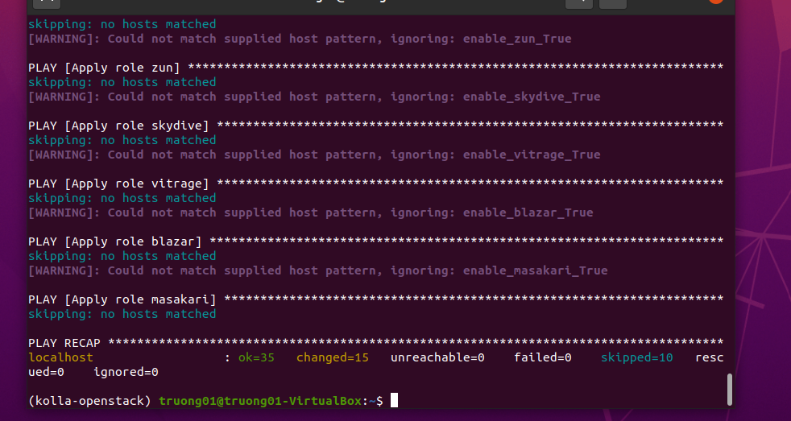
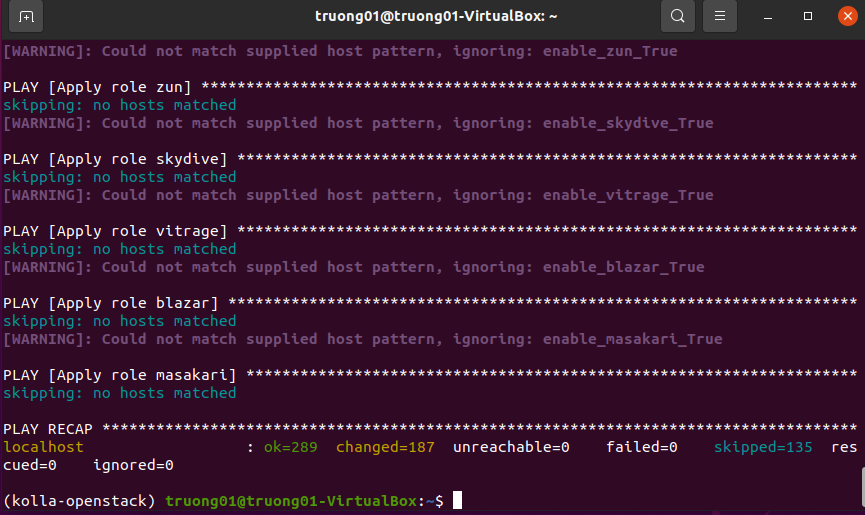
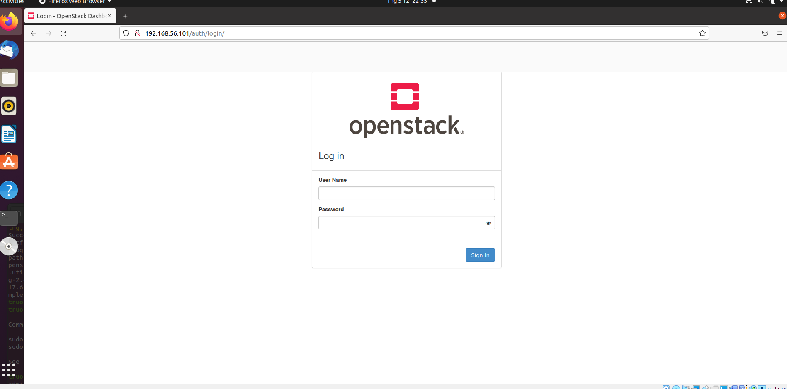
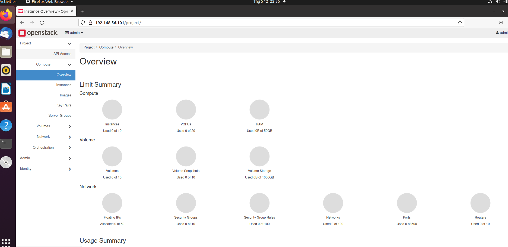

# Sec.1: ALL-IN-ONE OPENSTACK DEPLOYMENT

---

## **Author:** *Nguyễn Quang Nhật Trường*

**Date of issue**: *May 12th 2022*

---

# **Table of Contents:**

## [I. Overview](#**I.-OVERVIEW**)

- ### [A. Openstack](#**A.-`OPENSTACK`**)

- ### [B. Kolla-Ansible](#**B.-`KOLLA-ANSIBLE`**)

## [II. Prerequisite](#**II.-PREREQUISITE**)

## [III. Implementation](#**III.-IMPLEMENTATION**)

- ### [A. Install dependencies](#**INSTALL-DEPENDENCIES**)

- ### [B. Install Ansible and Kolla-ansible](#**INSTALL-ANSIBLE-AND-KOLLA-ANSIBLE**)

- ### [C. Deploy Openstack](#**DEPLOY-OPENSTACK**)

- ### [D. Post Deployment](#**POST-DEPLOYMENT**)

- ### [E. Access Horizon Dashboard](#**ACCESS-HORIZON-DASHBOARD**)

## [IV. Debug](#III.-DEBUG)

---

# **I. OVERVIEW**

## **A. Openstack**

OpenStack là một platform điện toán đám mây nguồn mở hỗ trợ cả public clouds và private clouds. Nó cung cấp giải pháp xây dựng hạ tầng điện toán đám mây đơn giản, có khả năng mở rộng và nhiều tính năng phong phú.

Openstack là một cloud software được thiết kế để chạy trên các sản phẩm phần cứng như x86, ARM. Nó không có yêu cầu gì về đặc tính phần mềm hay phần cứng, nó tích hợp với các hệ thống kế thừa và các sản phẩm bên thứ ba.

Ban đầu, OpenStack được phát triển bởi NASA và Rackspace, phiên bản đầu tiên vào năm 2010. Định hướng của họ từ khi mới bắt đầu là tạo ra một dự án nguồn mở mà mọi người có thể sử dụng hoặc đóng góp. OpenStack dưới chuẩn Apache License 2.0, vì thế phiên bản đầu tiên đã phát triển rộng rãi trong cộng đồng được hỗ trợ bởi hơn 12000 cộng tác viên trên gần 130 quốc gia, và hơn 150 công ty bao gồm Redhat, Canonical, IBM, AT&T, Cisco, Intel, PayPal, Comcast và một nhiều cái tên khác. Đến nay, OpenStack đã cho ra đời 13 phiên bản bao gồm: Austin, Bexar, Cactus, Diablo, Essex, Folsom, Grizzly, Havana, Icehouse, Juno, Kilo, Liberty, Mitaka.

Các thành phần của OpenStack:

- OpenStack compute: là module quản lý và cung cấp máy ảo. Tên phát triển của nó Nova. Nó hỗ trợ nhiều hypervisors gồm KVM, QEMU, LXC, XenServer... Compute là một công cụ mạnh mẽ mà có thể điều khiển toàn bộ các công việc: networking, CPU, storage, memory, tạo, điều khiển và xóa bỏ máy ảo, security, access control. Bạn có thể điều khiển tất cả bằng lệnh hoặc từ giao diện dashboard trên web.

- OpenStack Glance:là OpenStack Image Service, quản lý các disk image ảo. Glance hỗ trợ các ảnh Raw, Hyper-V (VHD), VirtualBox (VDI), Qemu (qcow2) và VMWare (VMDK, OVF). Bạn có thể thực hiện: cập nhật thêm các virtual disk images, cấu hình các public và private image và điều khiển việc truy cập vào chúng, và tất nhiên là có thể tạo và xóa chúng.

- OpenStack Object Storage: dùng để quản lý lưu trữ. Nó là một hệ thống lưu trữ phân tán cho quản lý tất cả các dạng của lưu trữ như: archives, user data, virtual machine image … Có nhiều lớp redundancy và sự nhân bản được thực hiện tự động, do đó khi có node bị lỗi thì cũng không làm mất dữ liệu, và việc phục hồi được thực hiện tự động.

- Identity Server: quản lý xác thực cho user và projects.

- OpenStack Netwok: là thành phần quản lý network cho các máy ảo. Cung cấp chức năng network as a service. Đây là hệ thống có các tính chất pluggable, scalable và API-driven.

- OpenStack dashboard: cung cấp cho người quản trị cũng như người dùng giao diện đồ họa để truy cập, cung cấp và tự động tài nguyên cloud. Việc thiết kế có thể mở rộng giúp dễ dàng thêm vào các sản phẩm cũng như dịch vụ ngoài như billing, monitoring và các công cụ giám sát khác.

## **B. Kolla-Ansible**

Openstack Kolla là Project hay công cụ sử dụng để triển khai, vận hành Openstack. Kolla được phát hành từ phiên bản Kilo và chính thức trở thành Project Openstack tại phiên bản Liberty.

Với ý tưởng của Project Kolla là triển khai Openstack trong môi trường Container, tự động triển khai Openstack bằng Kolla Ansible. Qua đó chỉ với 1 vài thao tác, chúng ta đã có môi trường Openstack để sử dụng. Hơn nữa, Project Kolla cũng cung cấp sẵn các giải pháp về giám sát, HA, Rolling Upgrades … cho Openstack

# **II. Prerequisite**

Network: 3

    NAT ```enp0s9``` 10.0.4.15
    Host-only ```enp0s8``` 192.168.56.101
    Bridged ```enp0s3``` 

Operating System:

    Ubuntu 20.04 LTS

Desktop Hypervisor:

    VMware Workstation (Other options: Virtual Box, etc)

Host VM Specifications:

    CPU: 4 cores
    RAM: 8GB
    Disks: 2 (Minimum capacity: 20GB)
    Network: 2NICs

# **III. Implementation**

## **A. Install dependencies**

1. Update and upgrade your system packages:

        sudo apt update
        sudo apt upgrade

2. Install the required packages:

        sudo apt install python3-dev python3-venv libffi-dev gcc libssl-dev git

3. Create and activate a virtual environment for deploying Kolla-ansible:

        python3 -m venv $HOME/kolla-openstack
        source $HOME/kolla-openstack/bin/activate

4. Install pip:

        pip install -U pip

## **B. Install Ansible and Kolla-ansible**

1. Install Ansible:

        pip install 'ansible<5.0'

    Success:
    

2. Config Ansible:
    For best results, Ansible configuration should be tuned for your environment. For example, add the following options to the Ansible configuration file ``/etc/ansible/ansible.cfg`` :

        vim $HOME/ansible.cfg
        
        [defaults]
        host_key_checking=False
        pipelining=True
        forks=100

3. Install Kolla-Ansible:

        pip install kolla-ansible

4. Configure Kolla-ansible for All-in-one OpenStack Deployment:

    4.1 Create Kolla configuration directory:

        sudo mkdir -p /etc/kolla

    4.2 Update the ownership of the Kolla config directory to the user with which you activated Koll-ansible deployment virtual environment as.

        sudo chown $USER:$USER /etc/kolla

    4.3 Copy the main Kolla configuration file, globals.yml and the OpenStack services passwords file, passwords.yml into the Kolla configuration directory above from the virtual environment.

        cp $HOME/kolla-openstack/share/kolla-ansible/etc_examples/kolla/* /etc/kolla/

    4.4 Copy Kolla-ansible deployment inventory to the current working directory. In this tutorial, we are deploying all-in-one OpenStack with Kolla-ansible. Hence, copy the all-in-one ansible inventory file.

        cp $HOME/kolla-openstack/share/kolla-ansible/ansible/inventory/all-in-one .

    4.5 Define Kolla-Ansible Global Deployment Options:

   - Open the globals.yml configuration file and define the AIO Kolla global deployment options

        vim /etc/kolla/globals.yml

   - Below are the basic options that we enabled for our AIO OpenStack deployment.

        kolla_base_distro: "ubuntu"
        kolla_install_type: "source"
        network_interface: "enp0s8"
        neutron_external_interface: "enp0s3"
        kolla_internal_vip_address: "192.168.56.101"
        nova_compute_virt_type: "qemu"
        enable_haproxy: "no"
        enable_cinder: "yes"
        enable_cinder_backup: "no"
        enable_cinder_backend_lvm: "yes"

5. Create diskspace partition for Cinder:

        sudo pvcreate /dev/sdb
        sudo vgcreate cinder-volumes /dev/sdb

6. Generate Kolla password:

   Kolla passwords.yml configuration file stores various OpenStack services passwords. You can automatically generate the password using the Kolla-ansible kolla-genpwd in your virtual environment. All generated passwords will be populated to ```/etc/kolla/passwords.yml``` file.  

        kolla-genpwd

7. Check whether the configuration of inventory is correct or not:

        ansible -i all-in-one all -m ping

    

- ### [C. Pre-deploy-configurations](#**Deploy Openstack**)

## **C. Deploy Openstack**

1. Bootstrap Server:

        kolla-ansible -i all-in-one bootstrap-servers

    Success:

    

2. Precheck Server:

        kolla-ansible -i all-in-one prechecks

    Precheck Success:

    

3. Pull Images to VM:

        kolla-ansible -i all-in-one pull

    Pull image Success:

    

4. Deploy:

        kolla-ansible -i all-in-one deploy

    Deploy success:

    

## **D. Post Deployment**

1. Install Openstack CLI:

        pip install python-openstackclient -c https://releases.openstack.org/constraints/upper/xena

2. OpenStack requires an openrc file where credentials for admin user are set. To generate this file:

        kolla-ansible post-deploy

    Post-deploy success:

    

    Run `admin-openrc.sh`:

        source /etc/kolla/admin-openrc.sh

3. Openstack token issue:

    

## **E. Access Horizon Dashboard**

- Use following login account:

        username: admin
        password: Run below command to retrieve

  ```cat /etc/kolla/passwords.yml | grep -i keystone_admin_password```

Password to login:

        keystone_admin_password: DA52UsQx8S0M0VjyMgBoovfUIHh1uhK2uOgSNWrP
  
- Openstack Login page



- Openstack Dashboard



# **IV. Debug**


You might have a problem of your kolla ansible version. It not compatible with your Openstack Kolla version. Recommend version of ansible is Stable xena.


It's because of your internet connection. You should add one more interface, or use command to reset your connection until you have internet connection.

    sudo service network-manager restart

