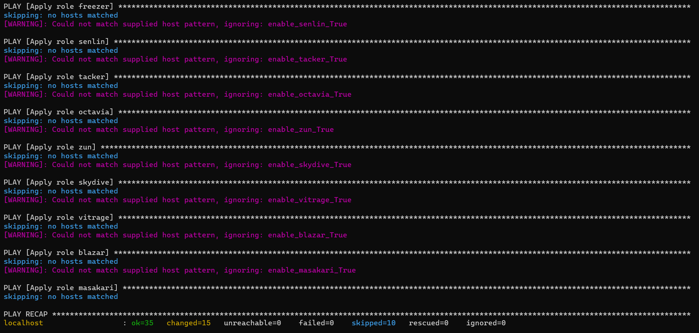
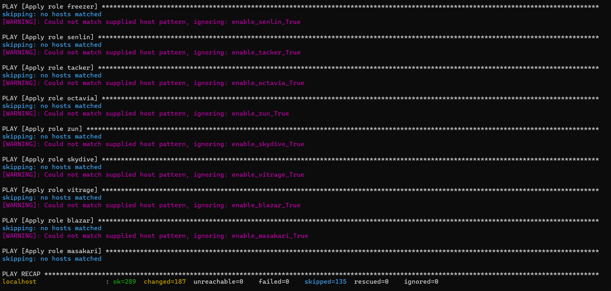
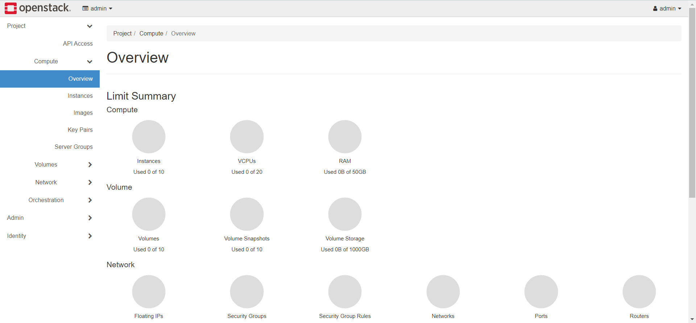

# WEEK-1 PRACTICE DOCUMENTATION   
 
----   
## Cài đặt Openstack All In One bằng Kolla-Ansible        
# Mục lục         
- [I. Overview](#overview)   
   - [1. Openstack](#openstack)           
   - [2. Kolla-Ansible](#kolla-ansible)                  
- [II. Yêu cầu](#yêu_cầu)   
   - [1. Kiến thức](#kiến_thức)      
   - [2. Cấu hình](#cấu_hình)       
         
- [III. Các bước thực hiện](#các_bước_thực_hiện)        
   - [1. Thiết lập môi trường ](#thiết_lập_môi_trường)    
   - [2. Cấu hình Openstack All In One](#cấu_hình_openstack_all_in_one)       
   - [3. Cài đặt Openstack All In One](#cài_đặt_openstack_all_in_one)     
   - [4. Cài đặt Openstack Client](#cài_đặt_openstack_client)              
   - [5. Đăng nhập vào Horizon ](#đăng_nhập_vào_Horizon)          
- [IV. Tài liệu tham khảo](#Tài_liệu_tham_khảo)             

----  
<a name='overview'></a>       

## I. Overview      

<a name='openstack'></a >      

### 1. Openstack 
- Mọi người tham khảo tại [đây](https://github.com/phupham1805/Intership/blob/master/Openstack/04_Open%20Stack.md)  
<a name='kolla-ansible'></a>     

### 2. Kolla - Ansible     
- `Openstack Kolla` là Project hay tools sử dụng để triển khai, vận hành Openstack.    
- Mục đích: sẵn sàng cung cấp `container` và `tools` để triển khai, vận hành clouds Openstack.  
- `Project Kolla` cung cấp sẵn các giải pháp bao gồm: `Monitoring`, `Rolling upgrades`, `HA`, etc.     

<a name='yêu_cầu'></a>    

## II. Yêu cầu     
<a name='kiến_thức'></a>        

### 1. Kiến thức   
- Kiến thức cơ bản về `ansible` (ansible.cfg, iventory, Playbook, Role, Task, etc...)        
- Kiến thức về `docker` (images, containers, volume, etc...)   

<a name='cấu_hình'></a>    

### 2. Cấu hình      
### Openstack Release: `Xena`   
- `Operating System (OS)`: Ubuntu 20.04 Server   
-  `Desktop Hypervisior`: VirtualBox 

||Đề xuất|Cấu hình của mình|     
|----|----|----|    
|CPU| 4 cores| 2 cores|   
|RAM| 8GB| 4GB|    
|HDD| 2 Disks| 2 Disks|   
|Network| 2 NICs| 2 NICs|    

- `Disks`  
  - `sda`: 60GB - for the OS   
  - `sdb`: 20GB - for Clinder LVM - `block storage component of Openstack`       

***Note: Hướng dẫn cách thêm disk mới vào VM trong VirtualBox*** [tại đây](https://vdodata.vn/huong-dan-tao-o-dia-ao-cho-may-ao-chay-tren-virtualbox/#:~:text=%C4%90%E1%BB%83%20t%E1%BA%A1o%20%E1%BB%95%20%C4%91%C4%A9a%20m%E1%BB%9Bi,d%E1%BA%A1ng%20l%C3%A0%20vmdk%20ho%E1%BA%B7c%20vdi.)        

- `Networks`: 2 NICs                
  - 1 NIC: sử dụng host only có IP là `enp0s8 - 192.168.56.103/24` (Dải mạng sử dụng cho API của Openstack và MNGT Network)        
  - 1 NIC: sử dụng NAT có IP là  ` enp0s3 - 10.0.2.15/24` (Địa chỉ giao tiếp với Openstack, dải này VM ra vào Internet)                  

<a name='các_bước_thực_hiện'></a>  

## III. Các bước thực hiện    
<a name='thiết_lập_môi_trường'></a>    

### 1. Thiết lập môi trường    

#### 1.1 `Update` & `Install` các package cần thiết 

```    
$ sudo apt update -y    
$ sudo apt install python3-dev libffi-dev gcc libssl-dev lvm2 -y 
```  
- Các bạn cần cấu hình đồng bộ `time`. Xem hướng dẫn tại [đây](https://linuxconfig.org/ubuntu-20-04-ntp-server)    

#### 1.2 Cài đặt `virtualenv` (Xem thêm tại: [VirtualEnv là gì ?](https://etuannv.com/huong-dan-su-dung-moi-truong-ao-virtual-environments-trong-python/#:~:text=Virtualenv%20l%C3%A0%20c%C3%B4ng%20c%E1%BB%A5%20cho,l%E1%BA%ADp%20cho%20t%E1%BB%ABng%20d%E1%BB%B1%20%C3%A1n.))            
```  
$ sudo apt install python3-venv -y   
```     
- Tạo `virtualenv` và kích hoạt    
```  
$ python3 -m venv /path/to/venv
$ source /path/to/venv/bin/activate         
```       
***Note: Bạn có thể thay đổi `/path/to/venv` thành đường dẫn bạn muốn***      
 
- Cài đặt phiên bản sớm nhất của `pip`    
```   
$ pip install -U pip   
```     

#### 1.3 Cài đặt `Ansible` & `Kolla Ansible` (đang ở trong môi trường ảo)    
   - Install `Ansible`:  
```   
$ pip install 'ansible<5.0'     
```   
   - Install `Kolla-ansible`:   
```   
$ pip install git+https://opendev.org/openstack/kolla-ansible@stable/xena        
```      
***Note: Đối với mỗi version của kolla-ansible sẽ có những phiên bản lớn Openstack khác nhau. Vì thế các bạn cần lưu ý khi cài Openstack nào tương ứng với version của kolla-ansible đó.***       
- Phiên bản kolla-ansible được phát triển dựa trên các phiên bả lớn Openstack 
   - Openstack Yoga - Kolla Ansible 14.x  
   - Openstack Xena - Kolla Ansible 13.0.x  
   - Openstack Victoria - Kolla Ansible 11.4.x   
   - Openstack latest - Kolla Ansible 14.1.x     

- Bài viết này mình sẽ cài Openstack Xena, chúng ta phải dùng version Kolla-Ansible 13.0.x

#### 1.4 Cấu hình `Kolla-Ansible` & `Ansible`   
- Tạo thư mục `/etc/kolla`        
```   
$ sudo mkdir -p /etc/kolla
$ sudo chown $USER:$USER /etc/kolla      
```   
- Copy `globals.yml` và `passwords.yml` đến thư mục `/etc/kolla`   
```   
$ cp -r /path/to/venv/share/kolla-ansible/etc_examples/kolla/* /etc/kolla  
```    
- Copy file inventory `all-in-one` đến thư mục hiện tại.    
``` 
$ cp /path/to/venv/share/kolla-ansible/ansible/inventory/* .
```   

- Cấu hình `Ansible`   
```    
$ sudo mkdir -p /etc/ansible    
$ sudo vi /etc/ansible/ansible.cfg     
```   
- Thêm vào file `ansible.cfg` content như sau:   
```  
[defaults]
host_key_checking=False
pipelining=True
forks=100 
```   

<a name='cấu_hình_openstack_all_in_one'></a>  

## 2. Cấu hình Openstack All In One   

- Tạo file chứa mật khẩu    
```  
$ kolla-genpwd   
```    
- Tạo phân vùng cho `Cinder`   
```   
$ sudo pvcreate /dev/sdb  
$ sudo vgcreate cinder-volumes /dev/sdb   
```  
- Thêm các cấu hình vào file `/etc/kolla/globals.yml`. 
```   
kolla_base_distro: "ubuntu"  
kolla_install_type: "source"    

network_interface: "enp0s8"   
neutron_external_interface: enp0s3    
kolla_internal_vip_address: 192.168.56.105         

nova_compute_virt_type: "qemu" 
enable_haproxy: "no"  

enable_cinder: "yes"
enable_cinder_backup: "no"  
enable_cinder_backend_lvm: "yes"     
```   

- Trong đó:        
  - `kolla_install_type`: Mã nguồn sử dụng khi deploy Openstack có 2 loại:  
      - Cài từ Source Code: `source`   
      - Cài từ File binary: `binary`   
  - `network_interface`: Interface  giữ IP giao tiếp với các thành phần của openstack.     
  - `neutron_external_interface`: interface dải Provider cung cấp IP cho các VM Openstack được tạo sau này.     
  - `kolla_internal_vip_address`: địa chỉ ip giao tiếp với các thành phần của openstack, config trường này sẽ tránh bị lỗi khi mariadb kết nối với ha proxy      
  
<a name='cài_đặt_openstack_all_in_one'></a>    

## 3. Cài đặt Openstack All In One   

- Khởi tạo môi trường dành cho Openstack Kolla   
```   
$ kolla-ansible -i all-in-one bootstrap-servers   
```   

   

- Kiểm tra thiết lập Kolla Ansible     
```   
$ kolla-ansible -i all-in-one prechecks   
```        

    

- Tải các Image Openstack   
``` 
$ kolla-ansible -i all-in-one pull       
```        
     
- Cài đặt Openstack  
```   
$ kolla-ansible -i all-in-one deploy  
```       

    

- Thiết lập file Environment Openstack     
```  
$ kolla-ansible -i all-in-one post-deploy   
```   
 
   

<a name='cài_đặt_openstack_client'></a>  

## 4. Cài đặt Openstack Client    

- Cài đặt các package cần thiết:   
```   
$ pip install python-openstackclient python-glanceclient python-neutronclient       
```    
- Chạy script sau để lấy cấu hình:       
```   
$ source /etc/kolla/admin-openrc.sh   
```       
- Kiểm tra dịch vụ:    
```  
openstack token issue    
```    

- Kết quả hiện về như sau là thành công !   
<a name='đăng_nhập_vào_Horizon'></a>   

### 5. Đăng nhập vào Horizon 
- Lấy mật khẩu để đăng nhập tài khoản admin:  
```  
cat /etc/kolla/passwords.yml | grep keystone_admin    
```       
- Kết quả:  
``` 
keystone_admin_password: ...      
```    
- Sau đó, bạn chỉ cần truy cập vào địa chỉ `http://192.168.56.105/auth/login/?next=/`. Nhập các thông số:   
   - ` User Name`: admin  
   - `Password`: ...     

- Đăng nhập thành công:     

   

----    

## Author: PhuPham  
### Date Issue: May 11th 2022       

- Mình sẽ cập nhật tiếp trong quá trình mình cài lại. 

<a name='Tài_liệu_tham_khảo'></a>    

## V. Tài liệu tham khảo   
[1] https://docs.openstack.org/kolla-ansible/xena/user/quickstart.html      
[2] https://news.cloud365.vn/openstack-kolla-phan-1-huong-dan-cai-dat-openstack-train-all-in-one-bang-kolla-ansible/      
[3] https://github.com/vietstacker/Viettel-Digital-Talent-Program-2021/blob/main/Phase-1-Practices/Week-3/Julian-P-Nguyen/Openstack/README.md     
[4] https://github.com/vietstacker/Viettel-Digital-Talent-Program-2021/blob/main/Phase-1-Practices/Week-3/Tran-Van-Thang/openstack-all-in-one.md#2-c%E1%BA%A5u-h%C3%ACnh-openstack-all-in-one    


