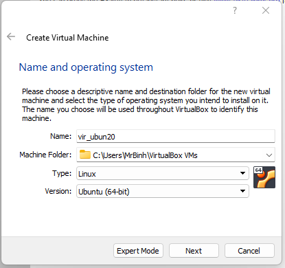
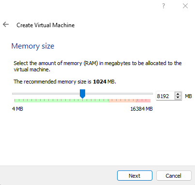
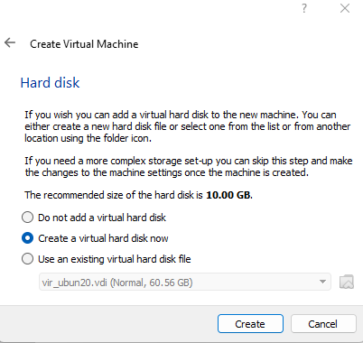
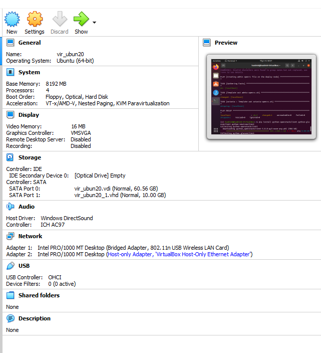

# **Setup OpenStack AIO inside Ubuntu VM with Kolla**
## **Table of Contents**

- [I. Create Ubuntu virtual machine ](#create_ubun_vm)   
   - [1. Requirements](#requirements)           
   - [2. Create VM using VirtualBox](#create_VM)

- [II. Deploy Openstack AIO inside VM with Kolla](#Open_stack_AIO)  
   - [A. Set up environment](#setup_env)    
   - [B. Configure Kolla-Ansible & Ansible](#configure_ansible)       
   - [C. Pre-deploy configuration](#pre_deploy_conf)   
   - [D. Deploy Openstack](#deployment_openstack)     
   - [E. Access horizon dashboard](#login) 

- [III. References](#refs)         
----  

## I. Create Ubuntu virtual machine
<a name='create_ubun_vm'></a >  

### 1. Configuration
<a name='Requirements'></a >  

- **Host Operating System**: *Windows 10*
- **Guest Operating System:** *Ubuntu 20.04*
- **Desktop Hypervisor:** *Virtual Box*
- **Openstack Release:** *Xena*
- **Application Installation** *git, lvm2, vim*

**Personal Notes:**
>  If **KVM** is used, virtual machine may not recognize network interface  
>  VirtualBox bridged adapter in host Ubuntu may not connect to Internet  

### 2. Create VM using VirtualBox
<a name='create_VM'></a >  

- Setup Guest OS:  
  

- Choose memory size:  
  

- Create a virtual hard disk:  
  

- Select hard disk file type:  
  

- Select fixed size for better performance in some aspects:  
  

- Setup operating system and a virtual hard disk
  

- Overall configuration:  
  

- **2 Network interface controller**:  
    - Bridged: `enp0s3 - 192.168.0.110/24 `
    - Host-only: `enp0s8`

## II. Deploy Openstack AIO inside VM with Kolla
<a name='Open_stack_AIO'></a >  

## **A. Set up environment**:
<a name='setup_env'></a > 

### 1. Update `apt` & install essentails dependencies:

```
$ sudo apt update

$ sudo apt install python3-dev libffi-dev gcc libssl-dev
```

### 2. Time Synchronization Configuration: **(Recommended)**
> Please refer to this [Documentation](https://linuxconfig.org/ubuntu-20-04-ntp-server)

### 3. Using `virtualenv`:
- Install `virtualenv`:
```
$ sudo apt install python3-venv
```

- Create `virutalenv` & activate that environment:
```
$ python3 -m venv v

$ source v
```

### 4. Install `Ansible` & `Kolla-Ansible` (within `virtualenv`):

- Install `Ansible`:
```
$ pip install 'ansible<5.0'
```

- Install kolla-ansible and its dependencies using pip

```
$ pip install git+https://opendev.org/openstack/kolla-ansible@stable/xena
```

- Create the /etc/kolla directory

```
$ sudo mkdir -p /etc/kolla
$ sudo chown $USER:$USER /etc/kolla
```

- Copy globals.yml and passwords.yml to /etc/kolla directory

```
$ cp -r /path/to/venv/share/kolla-ansible/etc_examples/kolla/* /etc/kolla
```

- Copy all-in-one and multinode inventory files to the current directory

```
$ cp /path/to/venv/share/kolla-ansible/ansible/inventory/* .
```

### 5. Install `Openstack CLI`:
> *Optional at this point*

**Notes:**

> Due to the fact that `open vSwitch` might capture `MAC Address` of network interace, which blocks connection to the Internet. Can install Openstack CLI from this step.

```
$ pip install python-openstackclient python-glanceclient python-neutronclient
```

## **B. Configure Kolla-Ansible & Ansible**
<a name='configure_ansible'></a > 

### 1. Create `/etc/kolla`  directory:

```
$ sudo mkdir -p /etc/kolla
$ sudo chown $USER:$USER /etc/kolla
```

### 2. Copy `passwords.yml` to `/etc/kolla`:
```
$ cp -r <path-to-virtualenv>/share/kolla-ansible/etc_examples/kolla/* /etc/kolla
```

### 3. Configure `Ansible`:
- For best results, Ansible configuration should be tuned for your environment. For example, add the following options to the Ansible configuration file /etc/ansible/ansible.cfg:  

```
[defaults]
host_key_checking=False
pipelining=True
forks=100
```

```
$ sudo mkdir -p /etc/ansible

$ config="[defaults]\nhost_key_checking=False\npipelining=True\nforks=100"

$ echo -e $config >> sudo /etc/ansible/ansible.cfg
```

## **C. Pre-deploy configuration**:
<a name='pre_deploy_conf'></a > 

### 1. Configure `all-in-one` (`inventory` file)
**Note**
> Optional. Should use defaults for `all-in-one`

### 2. Run `ad-hoc` command `ping` to check configurations:
```
$ ansible -i all-in-one all -m ping
```

> Ping Success:


### 3. Create diskspace partition for `Cinder` (*Block Storage*):

```
$ sudo pvcreate /dev/sdb

$ sudo vgcreate cinder-volumes /dev/sdb
```

### 4. Generate Passwords for `Kolla`:
- Stored in `/etc/kolla/passwords.yml` , run commands:

```
$ kolla-genpwd
```

Or

```
$ cd kolla-ansible/tools
$ ./generate_passwords.py
```

### 5. Configure `globals.yml`:

```
$ vi /etc/kolla/globals.yml
```

**Note**: *without specifying `openstack_release`, default value would be `victoria`*

**Example**: Sample `globals.yml` file

```
kolla_base_distro: "ubuntu"
kolla_install_type: "source"

network_interface: enp0s3
neutron_external_interface: enp0s8
kolla_internal_vip_address: 192.168.0.110

nova_compute_virt_type: "qemu"

enable_haproxy: "no"

enable_cinder: "yes"
enable_cinder_backup: "no"
enable_cinder_backend_lvm: "yes"
```

## **D. Deploy Openstack**
<a name='deployment_openstack'></a > 
- Bootstrap Server:

> **Debug**: [*Ansible Module Missing*](#'2.-`Cannot-import-name-'AnsibleCollectionLoader'-from-'ansible.utils.collection_loader'-during-Boostrapping`')

```
$ kolla-ansible -i all-in-one bootstrap-servers
```

> Boostrapping Success


- Precheck Server:
```
$ kolla-ansible -i all-in-one prechecks
```

> Prechecking Success


- Deploy:
```
$ kolla-ansible -i all-in-one deploy
```

>  Deploy Success


- Post-deploy:
```
$ kolla-ansible -i all-in-one post-deploy
```


## **E. Access horizon dashboard**:
<a name='login'></a > 

- Use following login account:
	- **username**: `admin`
	- **password**: *Run below command to retrieve*
	```
	$ cat /etc/kolla/passwords.yml | grep -i keystone_admin_password
	```

> Openstack Login page


> Openstack Dashboard


## III. References
<a name='refs'></a >  

[1] https://docs.openstack.org/kolla-ansible/xena/user/quickstart.html
 
[2] https://github.com/vietstacker/Viettel-Digital-Talent-Program-2021/blob/main/Phase-1-Practices/Week-3/Julian-P-Nguyen/Openstack/README.md

[3] https://github.com/vietstacker/Viettel-Digital-Talent-Program-2022/blob/main/Practice-1/DucDuongNguyen/README.md